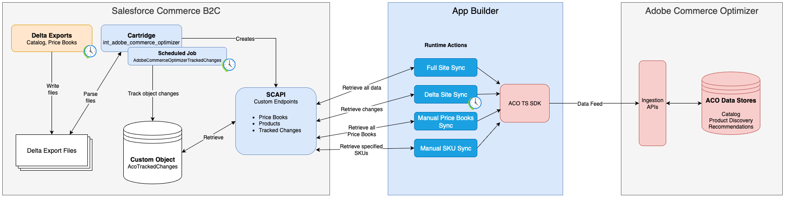
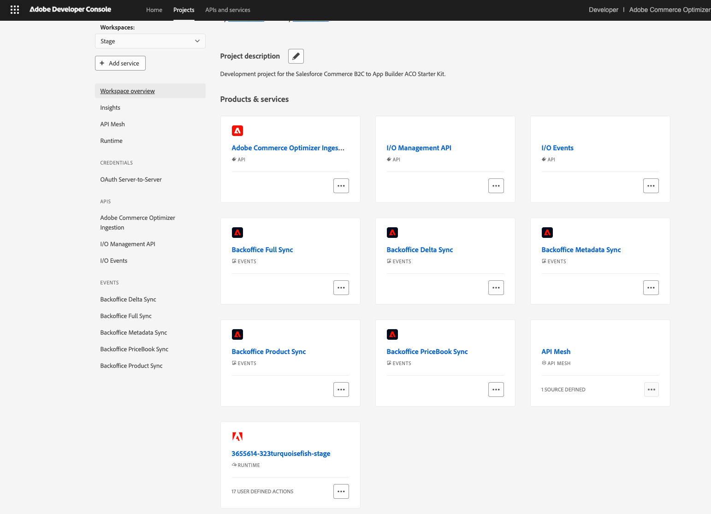

# ACO SFCC Starter Kit

> [!Important] Installation of the custom ACO SFCC Cartridge is required:
> [int_adobe_commerce_optimizer](https://github.com/adobe-commerce/aco-sfcc-cartridges).



## App Builder

The ACO SFCC Starter Kit runs on top of [App Builder](https://developer.adobe.com/app-builder/docs/intro_and_overview/).

Also see
[App Builder Architecture](https://developer.adobe.com/app-builder/docs/guides/app_builder_guides/architecture_overview/architecture-overview).

### Getting Started with App Builder

See
[App Builder Getting Started](https://developer.adobe.com/app-builder/docs/get_started/app_builder_get_started/app-builder-intro)
documentation.

## Installation

Follow the steps below to install and configure the ACO SFCC Starter Kit.

### Prerequisites

#### Install the AIO CLI

Run the following command to install the [AIO CLI](https://developer.adobe.com/runtime/docs/guides/tools/cli_install/).

```sh
npm install -g @adobe/aio-cli
```

#### Clone the Required Repositories

1. Clone the [ACO SFCC Starter Kit Repo](https://github.com/adobe-commerce/aco-sfcc-starter-kit) (this repository).
2. Clone the [ACO SFCC Cartridges Repo](https://github.com/adobe-commerce/aco-sfcc-cartridges).

#### Install the Required SFCC Cartridge

1. Follow the instructions in the
   [ACO SFCC Cartridges Repo README](https://github.com/adobe-commerce/aco-sfcc-cartridges/blob/main/README.md#installation)
   to install and enable the custom cartridge on your SFCC instance.

#### Create App Builder Project

1. Log in to the [Developer Console](https://developer.adobe.com/console).
   1. Click on **Create project from template**.
   2. Select **App Builder**.
   3. Give your project a name and a title.
   4. Click **Save**.
2. Select the **Stage** workspace.
3. Add the required API services to your new App Builder project.
   1. Click **Add service**.
   2. In the dropdown, select **API**.
   3. Select the **Adobe Commerce Optimizer Ingestion** card.
   4. Click **Next**.
   5. Click **Next**.
   6. Select the checkbox next to the **Default - Cloud Manager** profile.
   7. Click **Save configured API**
   8. Repeat the above steps for the following APIs to add them to your credential:
      1. I/O Events
      2. I/O Management API
4. Click the **Download all** button in the top right of the Developer Console to download the **Workspace JSON file**
   and save it as `workspace.json` in the `./scripts/onboarding/config` directory. This file will be used to configure
   the `IO_*` environment variables.

### Deploy and Onboard the Starter Kit

1. Copy the `.env.dist` to a new `.env` file.
2. Run the following commands to connect your starter kit with the App Builder project configured above.

   ```sh
   aio login
   aio console org select
   # Search for and select the organization that your Developer Console project belongs to.
   aio console project select
   # Search for and select the Developer Console project created above.
   aio console workspace select
   # Search for and select the desired workspace (ie. Stage).
   aio app use --merge
   # Confirm the highlighted project matches the one configured above.
   # This command will update your .env file with AIO related environment variables.
   ```

#### Configure the .env file.

1. ACO Configuration
   1. **ACO_TENANT_ID**: You ACO instance ID found in CCM.
   2. **ACO_REGION**: The region your ACO instance is deployed in (ie. na1 or eu1).
   3. **ACO_ENVIRONMENT_TYPE**: The type of ACO instance (sandbox or production).
   4. **ACO_STOREFRONT_URL**: The URL of your ACO site. Optional.
2. Auth Credentials
   1. **OAUTH_CLIENT_ID**: Found in Dev Console in the credential configured above.
   2. **OAUTH_CLIENT_SECRET**: Found in Dev Console in the credential configured above.
   3. **OAUTH_TECHNICAL_ACCOUNT_ID**: Found in Dev Console in the credential configured above.
   4. **OAUTH_TECHNICAL_ACCOUNT_EMAIL**: Found in Dev Console in the credential configured above.
   5. **OAUTH_ORG_ID**: Found in Dev Console in the credential configured above.
   6. **IO_CONSUMER_ID**: Found in the JSON file downloaded from Dev Console. Corresponds to key project.org.id
   7. **IO_PROJECT_ID**: Found in the JSON file downloaded from Dev Console. Corresponds to key project.id
   8. **IO_WORKSPACE_ID**: Found in the JSON file downloaded from Dev Console. Corresponds to key project.workspace.id.
3. SFCC Configuration
   1. **SFCC_API_BASE_URL**: The base URL of your SFCC instance’s SCAPI endpoint.
   2. **SFCC_REALM_ID**: Your SFCC instance’s Realm ID.
   3. **SFCC_INSTANCE_ID**: Your SFCC instance’s instance ID.
   4. **SFCC_ORGANIZATION_ID**: Your SFCC instance’s organization ID.
   5. **SFCC_SITE_URL**: The URL of the frontend of your SFCC site. Optional.
   6. **SFCC_ADMIN_SITE_URL**: The URL of the Business Manager backend of your SFCC site. Optional.
   7. **SFCC_SITE_ID**: The id of the SFCC site to sync.
   8. **SFCC_LOCALES_TO_SYNC**: A comma separated list of the locales to sync (ie. en-US,fr).
4. SFCC Credentials
   1. **SFCC_AUTH_URL**: The URL of the SFCC OAuth endpoint (ie.
      https://account.demandware.com/dwsso/oauth2/access_token).
   2. **SFCC_CLIENT_ID**: The ID of the SFCC Admin API client.
   3. **SFCC_CLIENT_SECRET**: The client secret associated with the SFCC Admin API client above.

#### Install Dependencies

Run the following command:

```sh
npm install
```

#### Deploy Your Starter Kit

Run the following command to deploy your starter kit to your Developer Console project:

```sh
aio app deploy
```

#### Onboard Your Starter Kit Actions

Run the following command to onboard the App Builder actions from your starter kit to your Developer Console project:

```sh
npm run onboard
```

#### Validate Deployed Actions

After the onboard command has completed, validate that the actions have been successfully deployed to the your
[Developer Console](https://developer.adobe.com/console) project.



## Actions

The ACO SFCC Starter Kit App Builder application provides a series of
[Runtime Actions](https://developer.adobe.com/app-builder/docs/guides/runtime_guides/creating-actions).

Action are defined in the [app.config.yaml](./app.config.yaml) file.

### Asynchronous Actions

Asynchronous actions run in a non-blocking context in the App Builder Runtime. They have a max timeout of 3 hours.

#### Full Site Sync

This action performs a full synchronization of all products, price books, and prices for the configured SFCC Site ID and
locales.

Location: `actions/full`

Entities Syncronized:

- Metadata
- Products
- Price Books
- Prices

#### Delta Site Sync

This action retrieves recent changes that have been made in SFCC since the last full or delta sync action and
synchonizes them with Commerce Optimizer.

By default, this action is scheduled to run every hour via the
[App Builder Cron](https://developer.adobe.com/app-builder/docs/resources/cron-jobs/lesson2) action configuration.

Location: `actions/delta`

Entities Syncronized:

- Products
- Price Books
- Prices

#### Price Book Sync

This action retrieves all price books in SFCC and syncronized them with Commerce Optimizer.

Location: `actions/price-book`

Entities Syncronized:

- Price Books

#### Metadata Sync

This action reads all metadata defined in the [data/metadata.js](./data/metadata.js) file and synchonized them with
Commerce Optimizer for each locale configured in the `SFCC_LOCALES_TO_SYNC` environment variable.

Location: `actions/metadata`

#### Specific Products Sync

This action retrieves product data for the provided SKUs (SFCC product IDs) from SFCC and synchronizes them with
Commerce Optimizer.

Location: `actions/product`

### Synchronous Actions AKA "Web Actions"

Synchronous actions run in a blocking context in the App Builder Runtime. They have a max timeout of 60 seconds and are
executed from the provided UI.

#### Ingestion Webhook

This action invokes an asynchronous action (like Full Sync) so that it can run in the background instead of the
synchronous web context.

Location: `actions/spa/ingestions`

#### Last Sync Timestamps

This action retrieves the timestamps or all of the last executed sync actions and serves the purpose of providing the
context of when the sync actions were last executed successfully. These values are pulled from AIO state.

Location: `actions/spa/last-sync-timestamps`

#### List Metadata

This action retrieves the metadata that will be syncronized during the Metadata Sync action. To customize the
synchronized metadata, edit the [data/metadata.js](./data/metadata.js) file.

Location: `actions/spa/list-metadata`

#### Validate Storefront Product Details

This action retrieves syncronized product details from the Commerce Optimizer Storefront API. This can be executed for a
given SKU, price book, and locale from the provided UI in order to validate syncronized data. This validation performs
the same storefront query that would be executed on a PDP page.

Location: `actions/spa/storefront`

#### SFCC Connectivity Check

This action performs a simple authenticated API call to one of the custom SCAPI endpoints. This validation ensures the
sync actions can communicate with SFCC.

Location: `actions/spa/connectivity/salesforce`

#### Commerce Optimizer Connectivity Check

This action performs a call to one of the Commerce Optimizer ingestion endpoints using the
[ACO TS SDK](https://github.com/adobe-commerce/aco-ts-sdk). This validation ensures the sync actions can communicate
with Commerce Optimizer using the SDK.

Location: `actions/spa/connectivity/aco`

## Logging

See the following App Builder documentation for more info:

- [Logging and Monitoring](https://developer.adobe.com/app-builder/docs/guides/runtime_guides/logging-monitoring)
- [Logging and Troubleshooting](https://developer.adobe.com/commerce/extensibility/app-development/best-practices/logging-troubleshooting)

### Tail All Action Logs

```sh
aio rt logs --tail
```

### List Activation Logs

List all runtime actions that have been activated.

```sh
aio rt activation list
```

### View Activation Log by ID

View the logs for a specific `activation_id`.

```sh
aio rt logs ${activation_id}
```

## Working With App State

See
[App Builder App State Docs](https://developer.adobe.com/app-builder/docs/guides/app_builder_guides/application-state).

### State Keys

In order to improve the behavior of the ACO SFCC Starter Kit sync actions, the following state keys are used:

- `lastSyncTimestamp`
- `lastFullSyncRun`
- `lastDeltaSyncRun`
- `lastPriceBookSyncRun`
- `lastMetadataSyncRun`
- `lastSpecificProductsSyncRun`
- `fullSyncInProgress`
- `deltaSyncInProgress`

#### Last Sync Timestamp

The `lastSyncTimestamp` key tracks the last time a full sync or delta sync operation retrieved data from SFCC and is
used as the starting point from which to retrieve SFCC data in future delta sync operations.

- Key: `lastSyncTimestamp`
- Example Value: `2025-07-24T00:13:45.341Z`
- Type: ISO 8601 String

#### Last Full Sync Run

The `lastFullSyncRun` key tracks the last time a full sync was successfully finished.

- Key: `lastFullSyncRun`
- Example Value: `2025-07-24T00:13:45.341Z`
- Type: ISO 8601 String

#### Last Delta Sync Run

The `lastDeltaSyncRun` key tracks the last time a delta sync was successfully finished.

- Key: `lastDeltaSyncRun`
- Example Value: `2025-07-24T00:13:45.341Z`
- Type: ISO 8601 String

#### Last Price Book Sync Run

The `lastPriceBookSyncRun` key tracks the last time a price book sync was successfully finished.

- Key: `lastPriceBookSyncRun`
- Example Value: `2025-07-24T00:13:45.341Z`
- Type: ISO 8601 String

#### Last Metadata Sync Run

The `lastMetadataSyncRun` key tracks the last time a metadata sync was successfully finished.

- Key: `lastMetadataSyncRun`
- Example Value: `2025-07-24T00:13:45.341Z`
- Type: ISO 8601 String

#### Last Specific Product Sync Run

The `lastSpecificProductsSyncRun` key tracks the last time a specific product sync was successfully finished.

- Key: `lastSpecificProductsSyncRun`
- Example Value: `2025-07-24T00:13:45.341Z`
- Type: ISO 8601 String

#### Full Sync In Progress

The `fullSyncInProgress` key indicates if an existing full sync action is already in progress. If this value is `true`
and another full sync or a delta sync operation if requested, it will be skipped.

- Key: `fullSyncInProgress`
- Example Value: `true`
- Type: Boolean

#### Delta Sync In Progress

The `deltaSyncInProgress` key indicates if an existing delta sync action is already in progress. If this value is `true`
and another delta sync or a full sync operation if requested, it will be skipped.

- Key: `deltaSyncInProgress`
- Example Value: `false`
- Type: Boolean

### Get State by Key

```sh
aio app state get lastSyncTimestamp
```

### Delete State by Key

```sh
aio app state delete lastSyncTimestamp
```

## Local Dev

See [App Builder Development](https://developer.adobe.com/app-builder/docs/guides/app_builder_guides/development).

- `aio app dev` to start your local Dev server
- App will run on `localhost:9080` by default

By default the UI will be served locally but actions will be deployed and served from I/O Runtime.

## Test & Coverage

- Run `aio app test` to run unit tests for ui and actions
- Run `aio app test --e2e` to run e2e tests

## Deployment

See
[App Builder Deployment Overview](https://developer.adobe.com/app-builder/docs/guides/app_builder_guides/deployment/deployment).

- `aio app deploy` to build and deploy all actions on Runtime and static files to CDN
- `aio app undeploy` to undeploy the app

### Event Registration

Run the following command to register your events with your Dev Console Project:

```sh
npm run onboard
```

## Configuration

See
[App Builder Configuration Files](https://developer.adobe.com/app-builder/docs/guides/app_builder_guides/configuration/configuration).

### `.env`

You can generate this file using the command `aio app use`.

```bash
# This file must **not** be committed to source control

## please provide your I/O Runtime credentials
# AIO_RUNTIME_AUTH=
# AIO_RUNTIME_NAMESPACE=
```

### `app.config.yaml`

- Main configuration file that defines an application's implementation.
- More information on this file, application configuration, and extension configuration can be found
  [here](https://developer.adobe.com/app-builder/docs/guides/appbuilder-configuration/#appconfigyaml)

#### Action Dependencies

- You have two options to resolve your actions' dependencies:

  1. **Packaged action file**: Add your action's dependencies to the root `package.json` and install them using
     `npm install`. Then set the `function` field in `app.config.yaml` to point to the **entry file** of your action
     folder. We will use `webpack` to package your code and dependencies into a single minified js file. The action will
     then be deployed as a single file. Use this method if you want to reduce the size of your actions.

  2. **Zipped action folder**: In the folder containing the action code add a `package.json` with the action's
     dependencies. Then set the `function` field in `app.config.yaml` to point to the **folder** of that action. We will
     install the required dependencies within that directory and zip the folder before deploying it as a zipped action.
     Use this method if you want to keep your action's dependencies separated.

## Debugging in VS Code

While running your local server (`aio app dev`), both UI and actions can be debugged, to do so open the vscode debugger
and select the debugging configuration called `WebAndActions`. Alternatively, there are also debug configs for only UI
and each separate action.

## Typescript support for UI

To use typescript use `.tsx` extension for react components and add a `tsconfig.json` and make sure you have the below
config added:

```
 {
  "compilerOptions": {
      "jsx": "react"
    }
  }
```
